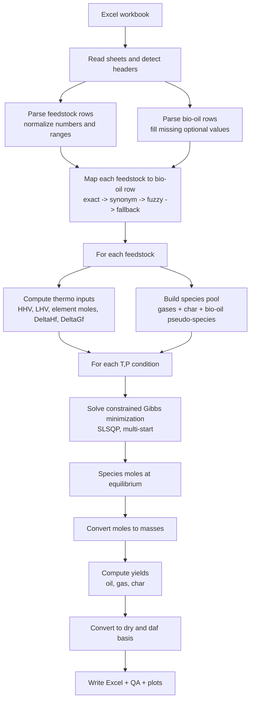

# Biomass Workflow Teaching Diagram

This file stores the detailed workflow diagram for teaching/presentation use.

```mermaid
flowchart TD
    A[Excel workbook] --> B[Read sheets and detect headers]
    B --> C[Parse feedstock rows\nnormalize numbers and ranges]
    B --> D[Parse bio-oil rows\nfill missing optional values]
    C --> E[Map each feedstock to bio-oil row\nexact -> synonym -> fuzzy -> fallback]
    D --> E

    E --> F[For each feedstock]
    F --> G[Compute thermo inputs\nHHV, LHV, element moles, DeltaHf, DeltaGf]
    F --> H[Build species pool\ngases + char + bio-oil pseudo-species]
    G --> I[For each T,P condition]
    H --> I

    I --> J[Solve constrained Gibbs minimization\nSLSQP, multi-start]
    J --> K[Species moles at equilibrium]
    K --> L[Convert moles to masses]
    L --> M[Compute yields\noil, gas, char]
    M --> N[Convert to dry and daf basis]
    N --> O[Write Excel + QA + plots]
```
