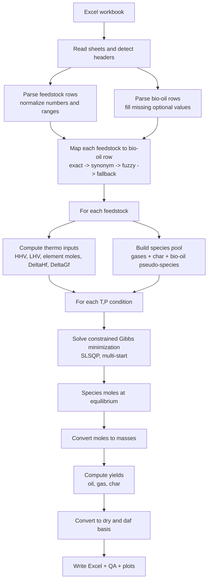

# Biomass Pyrolysis Workflow Guide

This is the single combined guide for the project.

It covers both:

1. How to run the program step by step.
2. How the model works from Excel data to oil-yield results.

## 1. What the program does

The workflow reads biomass and bio-oil data from Excel, computes thermodynamic properties, solves equilibrium, and reports:

- oil, gas, and char yields
- diagnostics and warnings
- analysis plots

Main runner:

- `tutorial.py`

## 2. Input files and sheets

The workbook must contain these sheets:

1. `w.proximate+ultimate`
2. `bio-oil values`

Important feedstock inputs include:

- moisture and ash (as-received)
- elemental composition C, H, O, N, S (daf basis)

## 3. Configure workbook path (path1/path2/path3)

Workbook path selection is now managed in:

- `tutorial_workbook_paths.py`

Set your paths in:

- `WORKBOOK_PATHS["path1"]`
- `WORKBOOK_PATHS["path2"]`
- `WORKBOOK_PATHS["path3"]`

Then choose active key:

- `ACTIVE_WORKBOOK_PATH_KEY = "path1"` (or `path2` or `path3`)

If the selected file does not exist, `tutorial.py` raises a clear error.

## 4. Environment setup

From the `BIOMASS_to_BIO-OIL` project folder, create and activate the virtual environment:

**Windows (PowerShell):**
```powershell
python -m venv .venv
.\.venv\Scripts\Activate.ps1
```

**macOS / Linux:**
```bash
python -m venv .venv
source .venv/bin/activate
```

Install dependencies (first time only):

```powershell
python -m pip install -r requirements.txt
```

## 5. Run the workflow

```powershell
python tutorial.py
```

## 6. Output files

The run writes a timestamped workbook to project root:

- `yield_results_YYYYMMDD_HHMMSS.xlsx`

The workbook includes sheets such as:

1. `results`
2. `acceptance_summary`
3. `unmatched_mappings`
4. `parse_warnings`
5. `solver_warnings`

It also writes plots to:

- `yield_results_plots`

Expected default plots:

1. `van_krevelen.png`
2. `van_krevelen_dry.png`
3. `van_krevelen_daf.png`
4. `ternary_cho.png`
5. `yield_basis_comparison.png`
6. `peak_yield_basis_comparison.png`
7. `peak_yield_vs_temperature.png`
8. `peak_yield_vs_temperature_dry.png`
9. `peak_yield_vs_temperature_daf.png`

## 7. Optional sweep mode

In `tutorial.py`:

- `enable_sweep = True` enables sweep mode.

Current tutorial settings use:

- temperature: 300 to 700 C in fast mode (or 800 C in full mode)
- pressure: 1 bar in fast mode (or up to 5 bar in full mode)

## 8. How the model works (simple explanation)

### 8.1 Data cleaning and matching

Before chemistry, the parser normalizes spreadsheet values:

- comma decimals (example: `10,5` to `10.5`)
- ranges (example: `10-20` to midpoint `15`)
- missing N/S defaults to `0.0`

Feedstocks are matched to bio-oil rows using ordered matching rules:

1. exact match
2. synonym-normalized match
3. fuzzy token overlap
4. optional Levenshtein fallback
5. category fallback

If no bio-oil row is found, a generic bio-oil pseudo-species can be used.

### 8.2 Convert feedstock to reactive element inventory

For 1 kg as-received feedstock:

$$
m_{dry} = 1 - \frac{M}{100}
$$

With inert ash treatment:

$$
m_{reactive} = m_{dry}\left(1 - \frac{Ash}{100}\right)
$$

Element moles for each element $e \in \{C,H,O,N,S\}$:

$$
m_e = m_{reactive}\left(\frac{w_{e,daf}}{100}\right), \qquad
n_e = \frac{1000\,m_e}{MW_e}
$$

### 8.3 Heating values and thermodynamic properties

HHV correlation used:

$$
HHV = 0.3491C + 1.1783H + 0.1005S - 0.1034O - 0.0151N - 0.0211Ash
$$

LHV:

$$
LHV = HHV - h_{we}\left(\frac{9H}{100} + \frac{M}{100}\right)
$$

with $h_{we} = 2.26\ \mathrm{MJ/kg}$ by default.

Then feedstock formation terms are estimated:

$$
\Delta h_f = LHV\cdot 1000 + n_C\Delta h_f^\circ(CO_2) + \frac{n_H}{2}\Delta h_f^\circ(H_2O) + n_S\Delta h_f^\circ(SO_2)
$$

$$
\Delta s_f = s_{abs} - s_{ref}, \qquad
\Delta g_f = \Delta h_f - T_{ref}\left(\frac{\Delta s_f}{1000}\right)
$$

Note: biomass and bio-oil entropy are currently heuristic in this version.

### 8.4 Candidate products and equilibrium solve

Candidate products include gas species, char, and one bio-oil pseudo-species.

For each feedstock and each condition $(T,P)$, the solver minimizes Gibbs energy:

$$
\min G_{total} = \sum_i n_i\mu_i
$$

subject to element balances:

$$
\sum_i a_{j,i}n_i = b_j \quad (j = C,H,O,N,S)
$$

Gas chemical potential term uses:

$$
\mu_i = g_i^0(T) + RT\ln\left(y_i\frac{P}{P^0}\right)
$$

with:

$$
g_i^0(T) = \Delta h_{f,i} - T s_i^0
$$

### 8.5 Convert moles to yields

Species mass:

$$
m_i = n_i\frac{MW_i}{1000}
$$

As-received yields:

$$
Y_{oil,ar} = \sum_{i \in liquid} m_i
$$

$$
Y_{gas,ar} = \sum_{i \in gas} m_i
$$

$$
Y_{char,ar} = \sum_{i \in solid\ char} m_i + \frac{Ash}{100}
$$

Dry and daf normalizations:

$$
f_{dry} = 1 - \frac{M}{100}, \qquad f_{daf} = f_{dry}\left(1 - \frac{Ash}{100}\right)
$$

$$
Y_{oil,dry} = \frac{Y_{oil,ar}}{f_{dry}}, \qquad Y_{oil,daf} = \frac{Y_{oil,ar}}{f_{daf}}
$$

For char daf, inorganic ash is removed first.

## 9. Visual workflow overview



## 10. Troubleshooting

### Problem: configured workbook not found

Cause: selected path key points to missing file.

Fix:

1. Open `tutorial_workbook_paths.py`.
2. Set the correct path under `WORKBOOK_PATHS`.
3. Select the correct `ACTIVE_WORKBOOK_PATH_KEY`.

### Problem: output file not created

Cause: run failed before export.

Fix:

1. Re-run and inspect terminal output.
2. Confirm required sheets exist.
3. Confirm required columns exist.

### Problem: many warnings in output

Cause: mapping gaps, ranges/incomplete values, or fallback assumptions.

Fix:

Inspect `parse_warnings` and `solver_warnings` in the generated `yield_results_*.xlsx`.

## 11. Optional verification

```powershell
python -m unittest discover tests -v
```